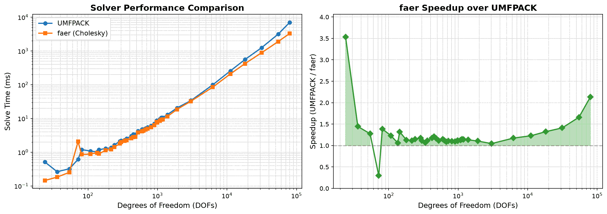

# Switching to faer as the Direct Solver

Some benchmarks comparing UMFPACK (the old C-based solver from suitesparse) against faer (pure Rust). 

faer ended up being better (1.25x) with
Plus removes the need for the extra c-deps on build needs on some systems.
## Stats

- Tested 39 different mesh sizes from 24 to ~80K DOFs
- faer won 38/39 cases
- Average speedup: 1.25x
- At 80K DOFs: **2.14x faster** (7.1s → 3.3s)

## Performance Plot

## By Problem Size
**Small meshes (< 1K DOFs):** ~1.15x faster.
**Medium meshes (1K-10K DOFs):** ~1.13x faster.
**Large meshes (> 10K DOFs):** 1.5-2x faster

Plus can handle larger problems without memory issues. However, this was probably due to my a misuse of the UMFPACK library.

## Accuracy
Both solvers give the same answer - they agree to ~15 significant digits. faer uses Cholesky decomposition which is mathematically equivalent to UMFPACK's LU for our symmetric positive-definite stiffness matrices.

| Mesh | DOFs | UMFPACK (ms) | faer (ms) | Speedup |
|------|------|--------------|-----------|---------|
| 5×3×3 | 288 | 2.11 | 1.79 | 1.18x |
| 10×5×5 | 1,188 | 10.66 | 9.36 | 1.14x |
| 25×12×10 | 11,154 | 255.5 | 208.0 | 1.23x |
| 50×20×16 | 54,621 | 3,164 | 1,905 | 1.66x |
| 60×22×18 | 79,971 | 7,057 | 3,303 | **2.14x** |
