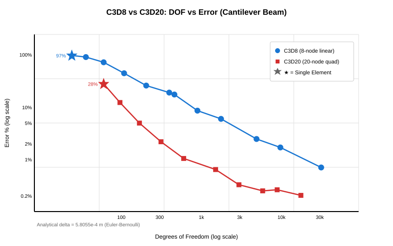
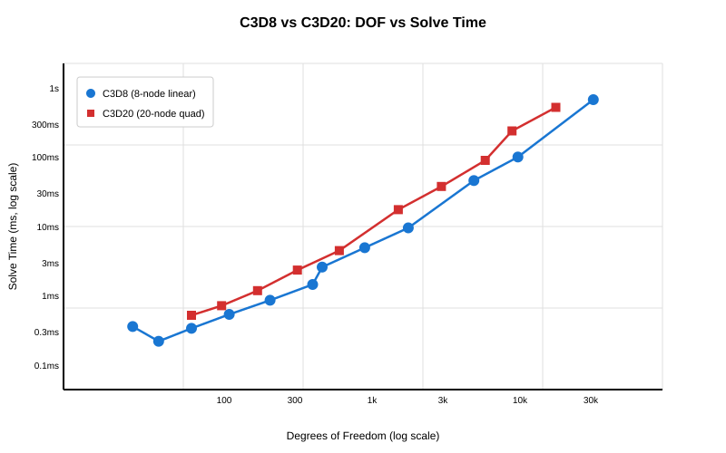

# C3D8 vs C3D20 Element Comparison

**Cantilever Beam Bending** — Aluminum, 1.0m × 0.1m × 0.1m, 1000 N tip load  
**Analytical Solution:** δ = 5.8055 × 10⁻⁴ m

## Accuracy (DOF vs Error)

## Solve Time (DOF vs Time)

## Summary

| Single Element | Error |
|----------------|-------|
| C3D8 (1×1×1) | 97% |
| C3D20 (1×1×1) | 28% |

**Key finding:** A single C3D20 element outperforms 10+ C3D8 elements. For bending problems, C3D20 converges much faster — reaching <1% error with ~600 DOF vs C3D8 needing ~30,000 DOF.
